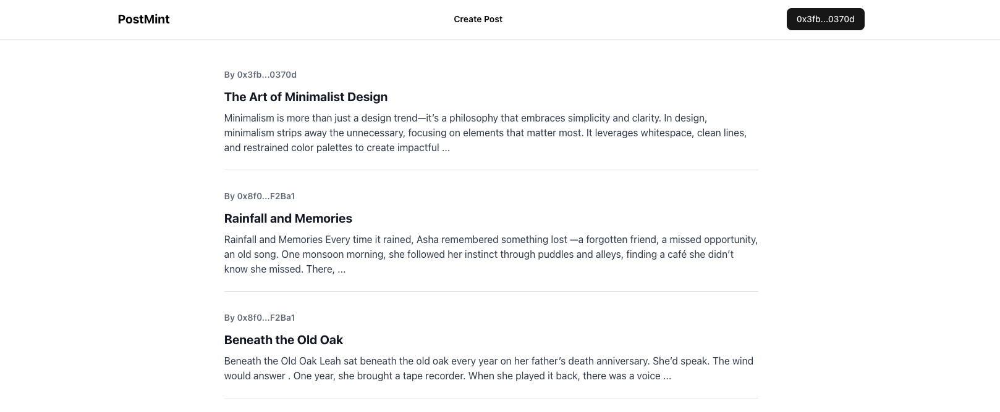

# PostMint 📝

**PostMint** enables writers to publish their content on-chain using the **Zora protocol**.



> You can check the code for backend here - [https://github.com/ashishbhintade/postmint-backend](https://github.com/ashishbhintade/postmint-backend)

[](https://base.org)
[![Built with Zora](https://img.shields.io/badge/Built%20with-Zora-000000?style=flat&logo=data:image/svg+xml;base64,PHN2ZyBoZWlnaHQ9IjI4IiB3aWR0aD0iMjgiIHZpZXdCb3g9IjAgMCAyOCAyOCIgZmlsbD0ibm9uZSIgeG1sbnM9Imh0dHA6Ly93d3cudzMub3JnLzIwMDAvc3ZnIj48Y2lyY2xlIGN4PSIxNCIgY3k9IjE0IiByPSIxNCIgZmlsbD0iIzAwMDAwMCIvPjxwYXRoIGQ9Ik0xMC4xNjcgMjIuMzQ3QzE1LjYyNyAyMi4zNDcgMjAuMjY2IDE4LjIxMyAyMC4yNjYgMTMuMTU1QzIwLjI2NiA4LjA5NiAxNS42MjcgMy45NjMgMTAuMTY3IDMuOTYzQzguMTk3IDMuOTYzIDYuMzk3IDQuNjY0IDUuMDAzIDUuODQyQzYuODkyIDQuNzc3IDguMzYyIDQuMDE2IDEwLjE2NyA0LjAxNkMxNC4yMzYgNC4wMTYgMTcuNzA1IDcuMzcxIDE3LjcwNSAxMS43NTVDMTcuNzA1IDE2LjEzOCAxNC4yMzYgMTkuNDkzIDEwLjE2NyAxOS40OTNDOC4zNjIgMTkuNDkzIDYuODkyIDE4LjczMiA1LjAwMyAxNy42NjZDNi4zOTcgMTguODQzIDguMTk3IDIwLjU0MiAxMC4xNjcgMjAuNTQyQzEzLjI2MyAyMC41NDIgMTUuNjI3IDE3LjI3MiAxNS42MjcgMTMuMTU1SDEzLjQ4NEMxMy40ODQgMTYuMDk1IDEyLjAzNSAxOC4yMjYgMTAuMTY3IDE4LjIyNkM4LjM1OSAxOC4yMjYgNi44OTIgMTYuNzY1IDYuODkyIDE0Ljk1NkM2Ljg5MiAxMy4xNDggOC4zNTkgMTEuNjg2IDEwLjE2NyAxMS42ODZDMTIuMDM1IDExLjY4NiAxMy40ODQgMTMuODE4IDEzLjQ4NCAxNi43NTlIMTUuNjI3QzE1LjYyNyAxMi42NDMgMTMuMjYzIDkuMzczIDEwLjE2NyA5LjM3M0M4LjA5NSA5LjM3MyA2LjI2MiAxMC44NjggNS41NzcgMTIuNzU0QzYuNzQzIDExLjU2NiA4LjI4OCAxMC44NDQgMTAuMTY3IDEwLjg0NEMxMy40MzkgMTAuODQ0IDE1LjYyNyAxMy43MzYgMTUuNjI3IDE3LjY1OUMxNS42MjcgMjEuNTgzIDEzLjQzOSAyNC40NzUgMTAuMTY3IDI0LjQ3NUM4LjI4OCAyNC40NzUgNi43NDMgMjMuNzUzIDUuNTc3IDIyLjU2N0M2LjI2MiAyNC40NTMgOC4wOTUgMjUuOTQ3IDEwLjE2NyAyNS45NDdDMTYuMjM3IDI1Ljk0NyAyMS42ODkgMjAuNzM0IDIxLjY4OSAxNC42NTNDMjEuNjg5IDguNTc0IDE2LjIzNyAzLjM2MSAxMC4xNjcgMy4zNjFDNC4wOTYgMy4zNjEgLTIuMjU2ZS0wNiA4LjU3NCAwIDE0LjY1M0MwIDIwLjczNCA1LjQ1MiAyNS45NDcgMTAuMTY3IDI1Ljk0N0MxMi4yMTMgMjUuOTQ3IDE0LjA2OCAyNS4xNzMgMTUuNDg1IDIzLjk3QzE0LjA3MSAyNC4zMzIgMTIuMjQ1IDI0LjQ3NSAxMC4xNjcgMjQuNDc1QzguMTk3IDI0LjQ3NSA2Ljg5MiAyMy43MTQgNS41NzcgMjIuNjQ5QzYuMzk3IDIxLjgyMiA4LjE5NyAyMi4zNDcgMTAuMTY3IDIyLjM0N1oiIGZpbGw9IiNGRkZGRkYiLz48L3N2Zz4=)](https://zora.co)

## ✨ Features

- Publish content directly on-chain via the **Zora Protocol**
- Store post data on **IPFS** using **Piñata**
- Minimal, elegant UI built with **Next.js** and **shadcn**
- Seamless wallet-based authentication and interaction
- End-to-end decentralization — content lives on **IPFS** and **Base**

## 🛠 Tech Stack Used

### Frontend

- **Next.js 15**, **TypeScript**
- **Tailwind CSS**, **Shadcn UI**

### Web3

- **Zora Coins SDK** – create/mint coins
- **Viem** – wallet interactions

### Storage

- **Piñata** – IPFS-based storage
- **Turso** – edge database for metadata

## Architecture

### API Routes

- GET `/api/posts` – Fetch all posts
- GET `/api/post` – Get post by CID
- POST `/api/upload` – Upload post data to IPFS
- POST `/api/coin-details` – Create CID and map to user address

### Account Management

- useWalletConnection (`/hooks/useWalletConnection.tsx`) – Manages wallet connection, account, and network changes

### Data Flow

1. User enters post title and content
2. Data is uploaded to IPFS → generates a CID
3. Metadata with Preview Image and Content CID is uploaded to IPFS
4. Metadata CID is used in `createCoin` method to mint a Zora coin
5. Coin metadata is saved and linked to the user's address

## ⚙️ How It Works

1. Writer connects their crypto wallet
2. Writes and formats content using a rich text editor
3. Content is uploaded to **IPFS** via **Piñata**
4. Post is minted on-chain using **Zora SDK**
5. Posts can be viewed through the UI or directly via IPFS

## Zora Integration 🌟

PostMint uses **Zora's Coins SDK** to mint posts as coins on **Base**

### Code Implementation

```ts
import { createCoin, DeployCurrency } from "@zoralabs/coins-sdk";

const coinParams = {
  name: title,
  symbol,
  uri,
  payoutRecipient: account as Address,
  platformReferrer: account as Address,
  chainId: baseSepolia.id,
  currency: DeployCurrency.ETH,
};

const result = await createCoin(coinParams, walletClient, publicClient, {
  gasMultiplier: 120,
});
```

## ☁️ Hosted On

- **Frontend** – Vercel
- **Backend** – Render
